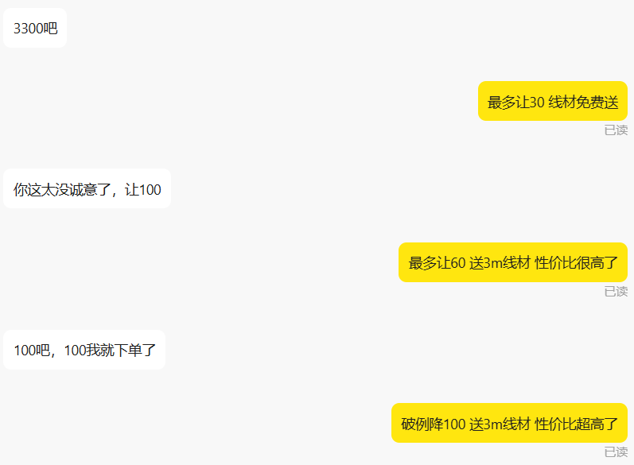
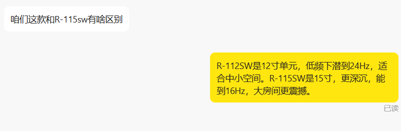
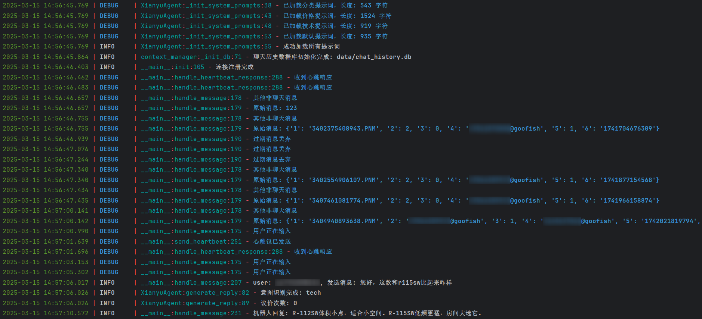

<div align="center">

# ⚡ Xianyu Auto Agent

### 🚀 复制即用 · 一键部署 · 7×24h 闲鱼自动值守

> **只需填2个参数 ➜ 双击 setup.bat ➜ 机器人自动上线**

[](https://www.python.org/)
[](LICENSE)
[](https://platform.deepseek.com/)
[]()
[]()

</div>

---

## 📦 复制一次，永远部署

**把 `XianyuAutoAgent` 文件夹复制到任何 Windows 电脑 → 双击 `setup.bat` → 完成。**


> 💡 **全程不超过 3 分钟，不需要懂代码，不需要装任何环境。**

---

## ✨ 凭什么选它？

<table>
<tr>
<td width="33%" align="center">
<h3>⚡ 一键部署</h3>
<p><code>setup.bat</code> 自动搞定 Python 虚拟环境 + 依赖安装 + 配置文件<br><b>双击即用</b></p>
</td>
<td width="33%" align="center">
<h3>🔄 永不掉线</h3>
<p>崩溃自动重启 · Token 自动刷新<br>心跳维持 · 开在那就永远在线<br><b>真正的 7×24h</b></p>
</td>
<td width="33%" align="center">
<h3>🧠 AI 智能对话</h3>
<p>LLM 多 Agent 系统<br>自动识别询价/议价/技术咨询<br><b>比人工回复更快更准</b></p>
</td>
</tr>
<tr>
<td width="33%" align="center">
<h3>📦 自动发货</h3>
<p>买家付款 → 自动发送网盘链接<br>数据库防重复 · 自动提醒补货<br><b>零人工干预</b></p>
</td>
<td width="33%" align="center">
<h3>💰 智能议价</h3>
<p>记录议价次数 · 阶梯让步<br>守住价格底线的同时提高成交率<br><b>比你自己谈得更好</b></p>
</td>
<td width="33%" align="center">
<h3>🔌 开机自启</h3>
<p>配置一次，重启电脑自动运行<br>不用手动操作，不用打开 Codex<br><b>真正的无人值守</b></p>
</td>
</tr>
</table>

---

## 🚀 3 步极速上手

### 第 1 步：拿 2 个东西

<table>
<tr>
<td width="50%">

**🔑 API Key** (去 DeepSeek 免费领)

```bash
1. 打开 https://platform.deepseek.com
2. 注册 → 创建 API Key
3. 复制以 sk- 开头的密钥
```

</td>
<td width="50%">

**🍪 闲鱼 Cookie** (从网页获取)

```bash
1. 打开 https://www.goofish.com 并登录
2. 按 F12 → Network → 刷新页面
3. 复制 Cookie 值
```

</td>
</tr>
</table>

### 第 2 步：一键部署

```bash
# 🪟 Windows 用户：
双击 setup.bat        ← 自动安装所有依赖

# 或者命令行：
git clone https://github.com/yelinyuan798-commits/XianyuAutoAgent.git
cd XianyuAutoAgent
setup.bat
```

### 第 3 步：填参数 → 启动

打开项目目录下的 `.env` 文件，把刚才拿到的 2 个东西填进去：

```ini
API_KEY=sk-你的密钥           # 👈 只改这里
COOKIES_STR=你的Cookie字符串   # 👈 和这里
```

然后 **双击 `start_bot.bat`** → 看到这行日志就成功了：

```
✅ 连接注册完成
```

> 🎉 **总共就这么多步骤，不需要配置数据库、不需要修改代码、不需要理解任何技术概念。**

---

## 🖼️ 效果图

<div align="center">
  <table>
    <tr>
      <td></td>
      <td></td>
      <td></td>
    </tr>
    <tr>
      <td align="center"><em>🏪 AI 自动回复买家</em></td>
      <td align="center"><em>💬 阶梯式智能议价</em></td>
      <td align="center"><em>🔧 技术问题解答</em></td>
    </tr>
  </table>
  <br>
  
  <br>
  <em>📊 后台实时日志</em>
</div>

---

## 📖 自动发货配置

打开 `data/delivery_items.json`，按这个格式加商品：

```json
{
  "items": {
    "8280123456": {
      "name": "Python 教程",
      "link": "https://pan.baidu.com/s/xxxxx",
      "code": "abcd",
      "note": "请尽快保存"
    }
  }
}
```

> **商品ID** = 闲鱼商品详情页 URL 中 `itemId=` 后面的数字

---

## 🏗️ 技术架构

```
闲鱼 WebSocket ─→ 消息解析 ─→ 意图分类(LLM)
                                  │
                    ┌─────────────┼─────────────┐
                    ▼             ▼             ▼
                议价专家       技术专家       客服专家
                 (price)       (tech)       (default)
                    │             │             │
                    └─────────────┼─────────────┘
                                  ▼
                          自动回复消息
                          自动发货
                          心跳维持
```

---

## ❓ 常见问题

<details>
<summary><b>❓ 我不会编程，能用吗？</b></summary>
能。全程只需要编辑一个 .env 文件填 2 个参数，双击 2 次 bat 文件。不需要写任何代码。
</details>

<details>
<summary><b>❓ 要准备什么？</b></summary>
一台 Windows 电脑 + 一个闲鱼账号 + 一个 DeepSeek 账号（免费注册）。
</details>

<details>
<summary><b>❓ 安全吗？会不会封号？</b></summary>
工具只模拟正常卖家的回复行为，不违反闲鱼平台规则。建议合理使用，不要滥用。
</details>

<details>
<summary><b>❓ 怎么切换人工/自动？</b></summary>
在闲鱼聊天中发送 <b>句号（。）</b> 即可在人工和 AI 模式间切换。
</details>

<details>
<summary><b>❓ 换电脑怎么迁移？</b></summary>
直接把整个文件夹复制到新电脑，双击 setup.bat 重新部署，复制 .env 文件即可。5 分钟搞定。
</details>

---

## 🤝 贡献

欢迎 Issue、PR、Star ⭐

---

<div align="center">

**如果你觉得这个项目有用，Star ⭐ 一下让更多人看到**

[](https://github.com/yelinyuan798-commits/XianyuAutoAgent)

</div>
